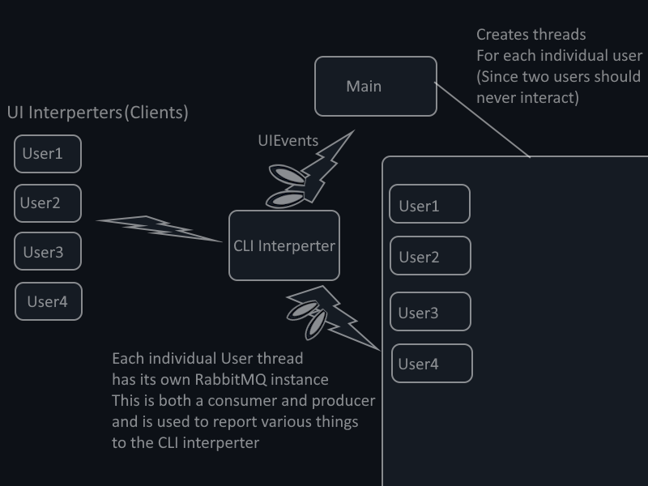

# Backend Docs
This is a explanation of the backend code and how the infrastructure is set up to support it

# UI Interperter
TBA

# CLI Interperter
The CLI Interpterter is meant to interpert user commands from the UI Interperter. It takes in user input from the UI Interperter (Though this functionality is not added yet) and passes on this information to the main backend over ``"ui_events"``.
Its implimentation may change may change currently it uses Pythons default ``argparse`` to parse through its data, However the implimentation is likely changing to CLI2 to help with assisted development.
Regardless of the implimentation, the only purpose of the UI Interperter is to send messages on the ``ui_events`` queue.

Example of a call from the command line for testing
``python interpreter_main.py -sid 103419348 s0 -c init``

Parameters for the networking protocol.
- ``State`` 
    - `Mostly Unusued in code right now, but will be is to communicate state based behavior from the backend back to the CLI interperter. Currently the backend just reports whenever its state has changed. Alongside what state the UI Interperter thinks the backend is in, allowing for debugging. For Efficiency this could likely be changed to its own topic.
    - Accessible by -s
  
| State    | Status                           |
| --       | -------                          |
| s0       |  Login                           |
| s1       | Waiting for Authentication State |
| s2       | Initializing                     |
| s3       | Initialized                      |

- ``SID``
The session ID of the user, will ideally be generated by a random nonce value or password hash in the final product. Is used to determine what user is accessing the backend. But additional checks should be required.
Accesible by -sid
- ``Command``
The command the back line should use, Currently only ``init`` is supported. Starting a user login on quickbooks, The backend will not initiate a login if it already has seen a SID with the same value.

# Main Backend
The main backend consists of the Main.py file, and several helper classes.

## Main.py Function Documentation
The main script that handles RabbitMQ message listening and OAuth flow management.

### Main Functions
- `main()`: Primary entry point that initializes RabbitMQ connection and waits for messages on the "ui_events" queue. Handles incoming messages and spawns OAuth threads.

- `oauth_flow(session_id)`: Handles the complete OAuth flow for QuickBooks authentication:
  - Loads environment variables
  - Initializes QuickBooks OAuth client
  - Generates and opens authorization URL
  - Starts callback server
  - Waits for authorization code
  - Exchanges code for tokens
  - Saves tokens to file

- `monitor_oauth_status(oauth_instance, auth_code, session_id)`: Continuously monitors OAuth session status and prints debug information.

## Quickbooks.py Function Documentation

### QuickbooksState Class
State machine implementation for tracking OAuth flow states:
- States: Start, Login, WaitingForAuth, Initializing, Initialized
- Handles state transitions and RabbitMQ messaging for state changes

### QuickbooksOAuth Class
Primary class handling OAuth authentication with QuickBooks:

- `__init__(environment="sandbox", port=8000, name="DefaultQuickbooks")`: Initializes OAuth client with environment settings and state machine

- `get_authorization_url()`: Generates OAuth authorization URL for user login
  - Requires Login state
  - Returns URL for user authentication

- `get_bearer_token(auth_code)`: Exchanges authorization code for access tokens
  - Requires WaitingForAuth state
  - Returns token dictionary

- `refresh_tokens(refresh_token)`: Refreshes expired access token
  - Requires Initialized state
  - Returns new token dictionary

- `revoke_tokens(refresh_token)`: Revokes active tokens
  - Returns success/failure boolean

- `save_tokens(tokens, filepath)`: Saves tokens to JSON file
  - Returns success/failure boolean

- `load_tokens(filepath)`: Loads tokens from JSON file
  - Returns token dictionary or None

### PaymentAPI Class
Subclass providing QuickBooks payment-specific API endpoints. All methods use the parent OAuth instance for authentication:

- `create_payment(payment_data)`: Creates new payment
- `read_payment(payment_id)`: Retrieves payment details
- `query_payments(query)`: Searches payments
- `update_payment(payment_data)`: Updates existing payment
- `delete_payment(payment_id, sync_token)`: Deletes payment
- `void_payment(payment_id, sync_token)`: Voids payment
- `get_payment_pdf(payment_id)`: Gets payment PDF
- `send_payment(payment_id, email)`: Sends payment via email

## Helper Classes

### RabbitMQ_Handler
Message queue handler that maintains both producer and consumer threads on the `ui_events` queue. Used by both the CLI interperter and the main backend to communicate.

#### Core Functions
- `__init__()`: Initializes connection variables and queue name
- `_try_connect()`: Attempts to establish RabbitMQ connection with retries
- `start()`: Creates producer and consumer threads, both subscribed to ui_events queue
- `queue_message(message)`: Queues message for asynchronous sending by producer thread
- `get_message(timeout=1)`: Retrieves message from consumer queue with timeout

#### Internal Thread Functions
- `_producer_loop()`: Continuously monitors message queue and publishes to RabbitMQ
- `_consumer_loop()`: Listens for messages on ui_events queue
  - Uses callback function to process and acknowledge messages
  - Automatically reconnects on connection loss

### TCP_Handler
Secure TCP connection handler for receiving authentication tokens from web backend.
**Note**: Currently unused, intended for future web backend integration.

#### Core Functions
- `__init__(host='localhost', port=8443)`: Initializes TLS settings and connection parameters
- `start_server()`: Starts TLS server and listens for connections
  - Creates SSL context with required certificate validation
  - Handles client authentication
  - Runs in separate thread

#### Security Features
- Requires valid client certificates
- Uses TLS 1.3
- Implements certificate pinning
- Validates token signatures

### server.py
Temporary development implementation for handling OAuth callback redirects.
**Note**: Should be replaced with proper web server implementation for production.

#### Functions
- `start_server()`: Starts local HTTPS server on port 8000
  - Creates SSL context for HTTPS
  - Handles only /callback endpoint

- `get_auth_code()`: Waits for and retrieves authorization code
  - Uses threading.Event for synchronization
  - Times out after 5 minutes
  - Returns authorization response dictionary containing:
    - code: OAuth authorization code
    - realmId: QuickBooks company ID
    - state: Security state parameter

- `RequestHandler class`: Handles callback requests
  - Processes OAuth redirect parameters
  - Sets response event when code received
  - Serves simple success/failure HTML pages

# TODO
- Make a proper class which determines what accounts on what sites the user is using, Currently. The backend just calls the Quickbooks class for testing and runs it on the thread, as opposed to a class which could handle multiple user accounts via there respective classes.
- Backend only differentiates users by SID, meaning one user can log in on the same account multiple times.
- Implement proper web server for production, replace `server.py` functionality

- 

